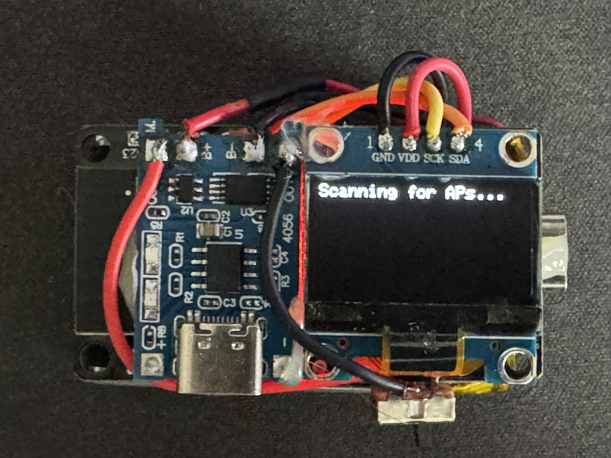

# ESP32 WiFi Deauther
Simple on boot ESP32-Wroom WiFi deauther, no configuration, just deauthing nearby WiFi on power

## DISCLAIMER
Ethical purposes only

## Hardware 
### Required
* ESP32-Wroom
### Optionnal
* 3.7 LiPo battery
* TP4056
* 3 Pins Slider
* SSD1306

## Firmware
### Web
Download the [firmware.bin](src/onBootDeauth.bin) file and use an [Online Web Flasher](https://esptool.spacehuhn.com/)

### VSCode
1. Download VSCode
2. Add PlatformIO extension
3. Build using the files on this repo

## Wiring with SSD1306
| SSD1306  | ESP32 |
| ------------- | ------------- |
| GND  | GND  |
| VCC  | 3.3V |
| SCK  | GPIO 22  |
| SDA  | GPIO 21  |

## Use
Power on the ESP32, it will first scan for AP then loop the deauth with a small delay  
SSD1306 should display the attacked networks
